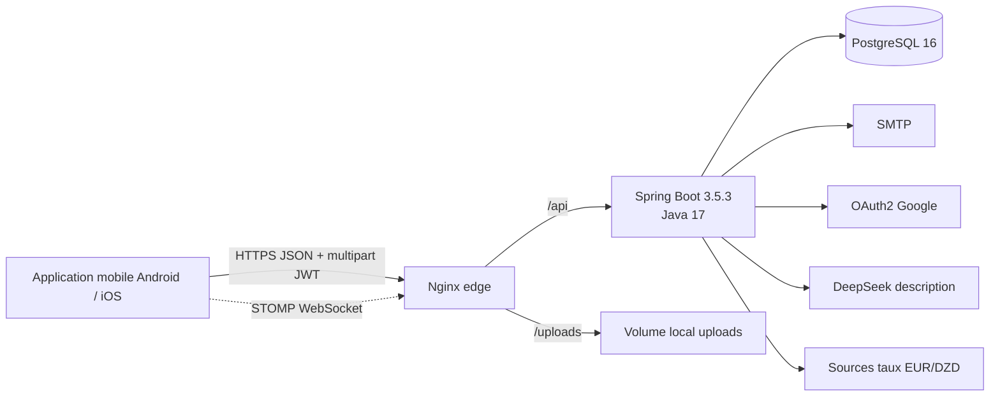
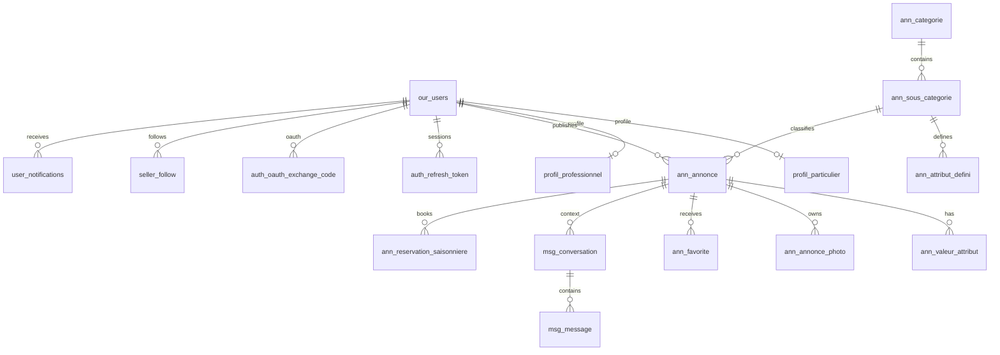

# Audit backend et préparation mobile — Bi3oo

Date d’audit : 23 juillet 2026 (mise à jour post-correctifs sécurité / QA web)  
Périmètre : dépôt `/var/www/preprod-bi3oo`, configuration préprod, API Spring live (`/v3/api-docs`).  
Méthode : lecture du code, Docker/Nginx, OpenAPI live, campagne QA régression WEB + validations ciblées après correctifs.

## Résumé exécutif

Bi3oo est un **monolithe Spring Boot** de petites annonces. L’API unique (JWT Bearer) sert déjà le WEB et est **prête à démarrer l’intégration mobile native**.

Les **bloquants P0** identifiés lors du premier audit sont **corrigés** :

| P0 initial | Statut |
|---|---|
| `X-User-Id` / `X-Admin` spoofables | **Corrigé** — identité / ownership via JWT (`CurrentUserService`) |
| Refresh token inutilisable | **Corrigé** — `POST /auth/refresh` opaque, hashé, rotatif, révocable |
| JWT dans URL OAuth | **Corrigé** — redirect `?code=` + `POST /auth/oauth/exchange` |
| Secrets dans defaults versionnés | **Corrigé** — secrets via env ; `GOOGLE_CLIENT_SECRET` préprod normalisé |
| CORS / STOMP `*` | **Corrigé** — allowlist `CORS_ALLOWED_ORIGINS` |
| Pas de Flyway | **Corrigé** — Flyway V1 baseline + V2 auth + V3 index listes |

Correctifs complémentaires validés en préprod (23/07) :

- `GET /taxo/sous-categories` → DTO plat (plus de récursion JSON / 500)
- Routes protégées sans JWT → **401 JSON** (plus de 302 OAuth)
- Anti-N+1 listes : EntityGraph + batch photos + index Flyway V3

**Note de préparation mobile : 84 / 100.**

| Axe | Score | Justification |
|---|---:|---|
| Catalogue et parcours publics | 90 | Taxonomie DTO, arbre, recherche, pagination, images |
| Authentification | 88 | JWT + refresh rotatif + OAuth code exchange + 401 JSON |
| Publication/gestion annonce | 88 | Ownership JWT, IDOR 403 validé, CRUD/pause/perf |
| Messagerie/notifications | 70 | REST complet ; STOMP présent, non validé E2E mobile |
| Exploitation et sécurité | 80 | Flyway, CORS allowlist, secrets env ; blacklist JWT encore mémoire |
| Documentation/contrat | 82 | OpenAPI 3.1.0 · **111** paths · guide + Postman à jour |

**Décision :** GO pour démarrer l’app native (catalogue + auth + publication). Avant grande audience : push FCM/APNs, blacklist multi-instance, pentest OAuth, STOMP reconnect, `ddl-auto=validate` en prod.

## Architecture



### Identification

| Sujet | Constat |
|---|---|
| Langages | Java 17 backend ; JavaScript/JSX frontend |
| Backend | Spring Boot 3.5.3, Spring MVC, Spring Security, Spring Data JPA |
| Architecture | monolithe modulaire MVC/service/repository |
| ORM | Hibernate/JPA + **Flyway** |
| Fronts | React 19 + Vite : legacy et nouveau design |
| Package managers | Maven Wrapper 3.9.10, npm |
| HTTP/proxy | Spring embarqué + Nginx 1.27 |
| Données | PostgreSQL 16 |
| Cache | `ConcurrentMapCacheManager` JVM (taux) ; pas Redis |
| Queue | aucune |
| Recherche | SQL/JPA |
| Storage | volume local `uploads` |
| Orchestration | Docker Compose |
| Temps réel | STOMP `/ws` |
| Jobs | refresh EUR/DZD 2 h ; sync taxonomie au démarrage |

## Déploiement et fichiers critiques

| Domaine | Fichiers |
|---|---|
| Conteneurs | `docker-compose.yml`, Dockerfiles backend/fronts |
| Sécurité | `SecurityConfig.java`, `RestAuthenticationEntryPoint.java`, `JWTAuthFilter.java`, `CorsConfig.java` |
| Auth session | `AuthSessionService.java`, entités `RefreshToken` / `OAuthExchangeCode` |
| Contrat API | `controller/**`, `RestApiExceptionHandler.java` |
| Migrations | `src/main/resources/db/migration/V2__*.sql`, `V3__*.sql` |
| Mobile/client | `docs/mobile_api.md`, `docs/postman/` |
| QA WEB | `docs/WEB_REGRESSION_VALIDATION_REPORT.md` |

Services Docker préprod : `postgres-staging`, `backend-staging`, `frontend-staging`, `frontend-new-design`. Ne jamais `docker compose down -v`.

## Authentification et autorisation

- JWT Bearer via `JWTAuthFilter` ; sans Bearer le contexte est vidé.
- **401 JSON** (`RestAuthenticationEntryPoint`) si route protégée non authentifiée — pas de redirect OAuth.
- OAuth2 Google : redirect frontend avec **`?code=`** ; mobile/web échange via `POST /auth/oauth/exchange`.
- `POST /auth/refresh` : refresh opaque, hash SHA-256, **rotation** (reuse → révocation / 403).
- `POST /auth/logout` : blacklist access (mémoire) + révocation refresh optionnelle dans le body.
- Session HTTP `IF_REQUIRED` uniquement pour le handshake OAuth.
- Rôles : `ADMIN`, `USER`, `USER_PAR`, `USER_PRO` ; `/admin/**` réservé admin.
- Mutations annonces : propriétaire = utilisateur JWT (admin peut encore cibler un autre `userId` métier).

Contrat mobile :

```http
Authorization: Bearer <access-token>
Accept: application/json
```

Stocker `token` + `refreshToken` dans Keychain/Keystore. Sur 401 access : tenter refresh une fois, sinon logout local.

## Base de données et relations

Entités JPA + tables auth session (refresh / oauth exchange). Flyway actif en préprod (`ddl-auto=none`).



Modules absents : paiement, panier, commande, coupons, livraison colis, avis, push FCM/APNs.

## Modules fonctionnels

| Module | État | Remarque mobile |
|---|---|---|
| Connexion, inscription, OTP, reset, refresh | disponible | intégrer en premier |
| OAuth Google (code exchange) | disponible | deep link + `POST /auth/oauth/exchange` |
| Profils | disponible | propriété serveur |
| Catalogue / taxonomie / recherche | disponible | `categories-tree` + DTO sous-catégories |
| Publication, images, modération | disponible | Bearer seul, sans `X-User-Id` |
| Favoris, suivi, signalements | disponible | |
| Messagerie | disponible | REST d’abord ; STOMP ensuite |
| Notifications in-app | disponible | pas de push OS |
| Réservation saisonnière | disponible | pas de paiement |
| Change EUR/DZD | disponible | public |
| Administration | disponible | hors app client |

## Sécurité et risques (état actuel)

| Priorité | Constat | Impact | Statut / action |
|---|---|---|---|
| ~~P0~~ | `X-User-Id` / `X-Admin` | IDOR | **Corrigé** |
| ~~P0~~ | Refresh inutilisable | sessions mobiles | **Corrigé** (`/auth/refresh`) |
| ~~P0~~ | JWT dans URL OAuth | fuite | **Corrigé** (code + exchange) |
| ~~P0~~ | Secrets defaults versionnés | compromission | **Corrigé** (env) |
| P1 | Blacklist JWT en mémoire | logout multi-instance | Redis ou table révocation |
| P1 | Mutations `filter-ui` pour tout authentifié | config globale | restreindre `ADMIN` |
| P1 | `show-sql` / Swagger préprod | métadonnées | durcir profils prod |
| P1 | `ddl-auto` hors préprod | dérive | `validate` en prod |
| P2 | STOMP non validé mobile | reconnect | tests Android/iOS |
| ~~P2~~ | N+1 listes | latence | **Atténué** (EntityGraph/batch/index V3) |

CSRF désactivé cohérent avec Bearer. Uploads limités (extensions + taille).

## Compatibilité mobile

### Directement utilisable

- API JSON/multipart sans cookie d’auth obligatoire.
- 401/403 JSON homogènes ; pagination Spring ; URLs images normalisables.
- Refresh rotatif + logout refresh.
- Catalogue / publication / favoris / messagerie REST validés en QA préprod.

### À vérifier sur appareils

- Accès préprod (cookie Nginx éventuel), TLS, uploads lents, deep links OAuth/reset.
- Reconnect STOMP, arrière-plan, RTL, batterie upload.

## OpenAPI, Swagger et Postman

```text
GET /v3/api-docs          → OpenAPI 3.1.0 · 111 paths (préprod 23/07/2026)
GET /swagger-ui.html      → Swagger UI
GET /swagger-ui/index.html
```

- Guide mobile : `docs/mobile_api.md`
- Collection Postman : `docs/postman/bi3oo-mobile.postman_collection.json`
- Environnement : `docs/postman/preprod.postman_environment.json`
- Rapport QA WEB : `docs/WEB_REGRESSION_VALIDATION_REPORT.md`

Importer `/v3/api-docs` dans Postman pour la couverture exhaustive des 111 chemins.

## Roadmap d’intégration

1. **Semaine 1** — Client HTTP, Keychain, parseur d’erreur, refresh automatique sur 401.
2. **Semaine 2** — Login / register / OTP / reset / OAuth exchange / logout.
3. **Semaine 3** — Taxonomie, catalogue, recherche, détail, profil vendeur.
4. **Semaine 4** — Favoris, follow, signalements, notifications.
5. **Semaine 5** — Publication EAV, modération, upload, mes annonces.
6. **Semaine 6** — Messagerie REST, réservation ; expérimenter STOMP.
7. **Avant sortie publique** — push natif, blacklist partagée, pentest, crash reporting, `ddl-auto=validate`.

## Performance

EntityGraph + batch photos sur listes publiques, manage, favoris, user. Index Flyway V3 sur `ann_annonce(created_at)`, `(status, created_at)`, `(user_id, created_at)`. Mesurer p95 et traces SQL avant lancement grand public.
